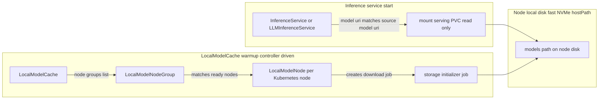
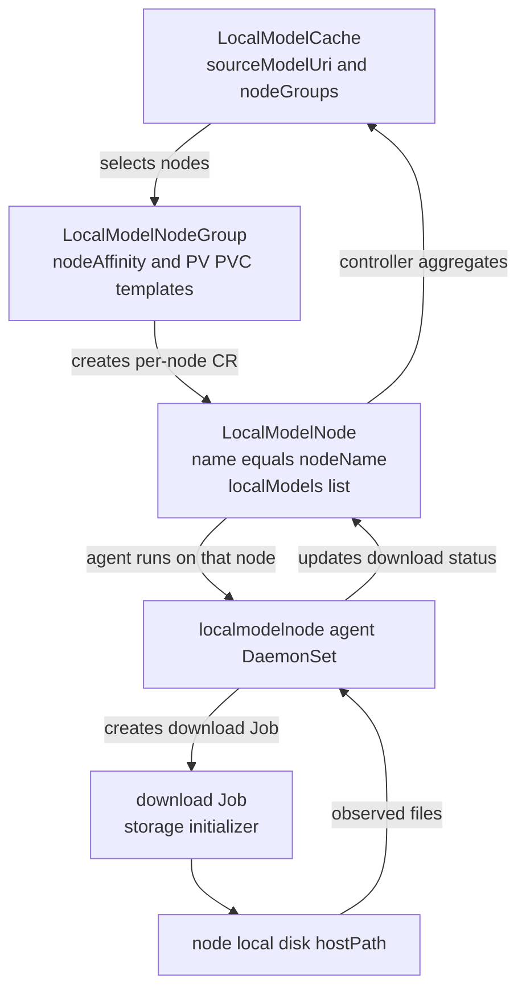
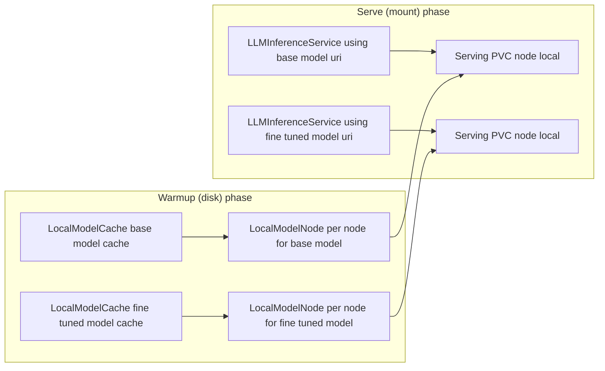
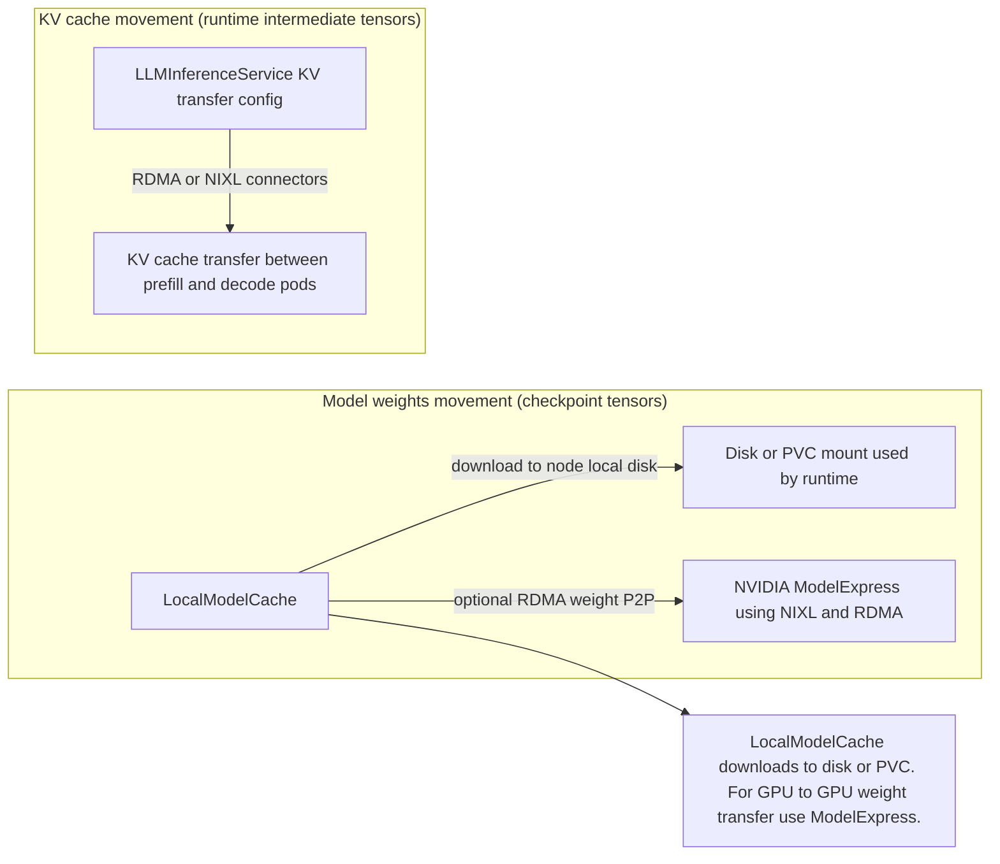
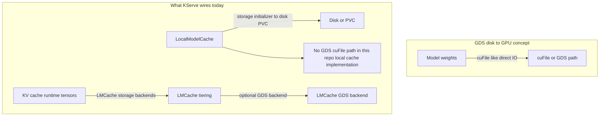

# LocalModelCache Detailed Guide

This document explains KServe's local model caching primitives and how to use them in a two-offering inference system:

1. A common base model (shared)
2. A fine-tuned model (stored in your org registry)

It also clarifies what is possible (and not possible) with RDMA/GDS for model movement in KServe today, and how to integrate NVIDIA ModelExpress if you want RDMA-based model weight transfer.

---

## 1. What problem LocalModelCache solves

KServe's `LocalModelCache` is designed to reduce model "cold start" time caused by repeatedly downloading large model checkpoints to every new inference pod.

The mechanism is:

* Before inference, `LocalModelCache` triggers one-time download jobs on selected Kubernetes nodes.
* Models are stored on those nodes' local disks (typically fast NVMe).
* When an inference service (LLMInferenceService / InferenceService) is created with a matching `model.uri` / `storageUri`, KServe mounts the already-downloaded files instead of downloading again.

Important: `LocalModelCache` accelerates *model weights availability on disk*; it does not change how vLLM loads weights into GPU memory (that is handled by your runtime, for example vLLM).



---

## 2. The three CRDs (what they are and how they work)

### 2.1 `LocalModelNodeGroup`

`LocalModelNodeGroup` defines "a pool of nodes + the local disk layout + PV/PVC templates".

It is a cluster-scoped CR:

* Scope: Cluster
* Who you create: you
* Who reconciles it: it is referenced by other controllers; it does not represent a per-node state machine.

Fields (from the API type):

* `spec.storageLimit`: a quota hint (not a direct enforcement guarantee)
* `spec.persistentVolumeSpec`: PV template (commonly uses `local.path` + `nodeAffinity`)
* `spec.persistentVolumeClaimSpec`: PVC template used for both:
  * download PVCs (where download jobs write)
  * serving PVCs (mounted by inference pods)

Conceptually, a `LocalModelNodeGroup` is "where models live" and "which nodes should participate".



#### Example (local NVMe PV via `local-storage`)

Adjust `local.path` and `nodeAffinity` to match your cluster.

```yaml
apiVersion: serving.kserve.io/v1alpha1
kind: LocalModelNodeGroup
metadata:
  name: workers
spec:
  storageLimit: 1Ti
  persistentVolumeSpec:
    accessModes: [ReadWriteOnce]
    storageClassName: local-storage
    volumeMode: Filesystem
    capacity:
      storage: 1Ti
    local:
      # MUST match the LocalModelNode agent DaemonSet hostPath (see section 3.4).
      path: /models
    nodeAffinity:
      required:
        nodeSelectorTerms:
          - matchExpressions:
              - key: nvidia.com/gpu.product
                operator: In
                values: ["NVIDIA-H100-SXM2-80GB"]
  persistentVolumeClaimSpec:
    accessModes: [ReadWriteOnce]
    storageClassName: local-storage
    resources:
      requests:
        storage: 1Ti
    volumeMode: Filesystem
```

#### Node affinity behavior

The local model controller selects nodes whose labels satisfy:

* `LocalModelNodeGroup.spec.persistentVolumeSpec.nodeAffinity`

Those selected nodes are considered "in the node group", and later `LocalModelNode` objects are created per selected node.

---

### 2.2 `LocalModelNode`

`LocalModelNode` is the per-Kubernetes-node state machine.

Key properties:

* Scope: Cluster
* Object name: it uses the Kubernetes node name (for example `gpu-worker-3`)
* It contains `spec.localModels`: the list of models that *should exist locally on that node*
* It contains `status.modelStatus`: the current download state per model (pending/downloading/downloaded/error)

From the API type, `LocalModelNodeSpec` is:

* `spec.localModels[]` is a list of `LocalModelInfo` entries

Each `LocalModelInfo` entry includes:

* `sourceModelUri`: where the model must be downloaded from
* `modelName`: model identity used for folder/PVC naming
* `namespace` (optional): for namespace-scoped cache (`LocalModelNamespaceCache`)
* `nodeGroup` (optional): tells the agent which node group name to use for PVC naming
* `serviceAccountName` / `storage`: credentials configuration for the download job

#### What the node agent actually does

On each node, a DaemonSet agent reads the `LocalModelNode` for *its own node only* and:

1. checks if the model folder exists on disk
2. if missing, creates a Kubernetes Job pinned to that node
3. the job downloads model artifacts into the node-local PVC (and writes into the hostPath-mounted directory)
4. updates `LocalModelNode.status.modelStatus`

So, downloads happen per node (because the storage is node-local).

---

### 2.3 `LocalModelCache`

`LocalModelCache` declares "what model(s) to pre-download and where (which node groups)".

Fields:

* `spec.sourceModelUri` (required): the model checkpoint URI (for example `hf://...`, `s3://...`)
* `spec.modelSize` (required): used for quota checks against the node group disk limit
* `spec.nodeGroups` (required): list of `LocalModelNodeGroup` names
* `spec.serviceAccountName` (optional): credentials for download job
* `spec.storage` (optional): alternative credential specification (storage key + optional parameters)

Matching behavior:

* `LocalModelCacheSpec.MatchStorageURI()` checks whether the inference `model.uri` matches `sourceModelUri`, OR is a subdirectory.
* Implementation detail: the match succeeds if `storageUri` is equal to `cachedUri` or begins with `cachedUri + "/"`.

Status:

* `status.nodeStatus[nodeName]`: the node download status for this cache
* `status.copies`: total/available/failed counts
* `status.inferenceServices` and `status.llmInferenceServices`: metadata about which inference services are using this cache

---

## 3. End-to-end workflow (base model + fine-tuned model)

This section shows a recommended way to implement two offerings:

* Base model: `hf://org/base-model`
* Fine-tuned model: `hf://org/fine-tuned-model` (your org registry may use HF, S3, or another supported scheme)



### 3.1 Prerequisites

1. Install KServe with the local model controller and node agent.
2. Make sure you have a storage class / PV mechanism for local disk (`local-storage` in the examples).
3. Configure download job settings by editing `inferenceservice-config` ConfigMap:
   * `localModel.enabled: true`
   * `localModel.jobNamespace`
   * `localModel.defaultJobImage`
   * `localModel.fsGroup`

For example (from the official guide):

```yaml
localModel: |-
  {
    "enabled": true,
    "jobNamespace": "kserve-localmodel-jobs",
    "defaultJobImage" : "kserve/storage-initializer:latest",
    "fsGroup": 1000,
    "reconcilationFrequencyInSecs": 60,
    "jobTTLSecondsAfterFinished": 3600
  }
```

### 3.2 Configure credentials (base + fine-tuned)

`LocalModelCache` can pass credentials in a few ways:

* `spec.serviceAccountName`: service account that has secrets mounted (HF token, S3 keys, etc.)
* `spec.storage.key` (via `LocalModelStorageSpec`): reference a key in a storage config secret (created in the download job namespace)
* `spec.storage.parameters`: inline parameter overrides for the storage config

See `docs/samples/localmodelcache/README.md` for concrete HF examples.

### 3.3 Create `LocalModelNodeGroup`

Create one node group (for example `workers`) that targets all nodes that can host inference and that have the required NVMe disk.

Pay special attention to section 3.4.

### 3.4 Important disk alignment: `local.path` vs agent `hostPath`

Your model bytes are written by download Jobs into a directory on the node (hostPath).

KServe's local model node agent mounts the hostPath into the agent pod at:

* mountPath: `/mnt/models`
* subdir structure: the agent uses `/mnt/models/models/<storageKey>/...`

But the **hostPath source path** comes from the DaemonSet.

The official KServe guide notes:

* Helm installs: default hostPath is often `/mnt/models`
* Kustomize installs: default hostPath is hard-coded (in this repo) to `/models`

In this repo, the DaemonSet template is:

* hostPath: `/models`
* mountPath in container: `/mnt/models`

So for this repo default, set `LocalModelNodeGroup.spec.persistentVolumeSpec.local.path` to `/models` (not `/mnt/models`).

You can verify your agent hostPath with:

```bash
kubectl get daemonset kserve-localmodelnode-agent -n kserve \
  -o jsonpath='{.spec.template.spec.volumes[?(@.name=="models")].hostPath.path}'
```

Then set `local.path` in `LocalModelNodeGroup` to that value.

Also ensure host directory ownership allows the agent and job user to write (for example `chown -R 1000:1000`).

### 3.5 Create the two `LocalModelCache` objects

#### Base model cache

```yaml
apiVersion: serving.kserve.io/v1alpha1
kind: LocalModelCache
metadata:
  name: base-model-cache
spec:
  sourceModelUri: "hf://org/base-model"
  modelSize: 40Gi
  nodeGroups:
    - workers
  # Option A:
  serviceAccountName: hf-downloader
  # Option B:
  # storage:
  #   key: hf-credentials
```

#### Fine-tuned model cache

```yaml
apiVersion: serving.kserve.io/v1alpha1
kind: LocalModelCache
metadata:
  name: finetuned-model-cache
spec:
  sourceModelUri: "hf://org/fine-tuned-model"
  modelSize: 55Gi
  nodeGroups:
    - workers
  serviceAccountName: hf-downloader
```

### 3.6 Use the cached models in inference services

The inference service must use a `model.uri` (LLMInferenceService) or `storageUri` (InferenceService) that matches `sourceModelUri` (or is a subdirectory).

KServe for LLMInferenceService:

* It uses a webhook defaulter to check caches and then:
  * sets a local model label
  * rewrites the model URI to a `pvc://.../models/<storageKey>/<subpath>` mount

So for the base offering:

* `LLMInferenceService.spec.model.uri` should be `hf://org/base-model`

For the fine-tuned offering:

* `LLMInferenceService.spec.model.uri` should be `hf://org/fine-tuned-model`

---

## 4. RDMA-based movement of model weights vs KV cache

This section answers a frequent confusion:

* RDMA can move different types of data:
  * model weights (checkpoint tensors)
  * KV cache tensors (runtime intermediate state)
* LocalModelCache is about weights on disk, not RDMA transport.



### 4.1 What LocalModelCache does for movement

LocalModelCache triggers downloads via `storage-initializer` (and storage backends like HF/S3) into node-local storage.

That is not an RDMA transport path.

If you want RDMA-based movement of model weights, you typically need a different system that:

* loads the model once (source)
* transfers weights over RDMA/GPU P2P to other GPUs (targets)

### 4.2 Model weight RDMA transfer: use NVIDIA ModelExpress

KServe has no native "turn on RDMA weight transfer for model loading" switch.

NVIDIA (ai-dynamo) ModelExpress is built specifically for this:

* it runs a gRPC server and coordinates model weight lifecycle
* it supports vLLM integration via an `mx`/`modelexpress` loader
* it uses NIXL + RDMA/InfiniBand for GPU-to-GPU transfer in P2P mode

From ModelExpress README:

* "GPU-to-GPU transfer via NIXL/RDMA instead of loading from storage"
* "vLLM `modelexpress` loader (`mx` alias)"

#### How to integrate ModelExpress with LLMInferenceService

High-level approach (because KServe does not implement ModelExpress directly):

1. Deploy ModelExpress server (Helm) with `MX_METADATA_BACKEND` set (Redis or Kubernetes CRD).
2. Use a vLLM image that has ModelExpress loaders registered.
3. In your `LLMInferenceService` pod template, pass vLLM flags via `VLLM_ADDITIONAL_ARGS`.
4. Ensure your model loading path uses the ModelExpress loader.

##### Example: vLLM arguments pattern

ModelExpress recommends:

* `--load-format modelexpress` (and `mx` is an alias)

In KServe, your container command uses `${VLLM_ADDITIONAL_ARGS}` appended to `vllm serve`, so you can pass:

* `--load-format modelexpress`
* any additional ModelExpress-specific settings (for example `MODEL_EXPRESS_URL`, `MX_*`, depending on their docs)

##### Example: wiring in a KServe `LLMInferenceService` pod template

This is an illustrative fragment (adapt it to your exact vLLM image and your cluster's RDMA/UCX setup):

```yaml
spec:
  model:
    uri: hf://org/base-model
    name: base-model
  template:
    containers:
      - name: main
        env:
          # Register the modelexpress and mx loaders in vLLM
          - name: VLLM_PLUGINS
            value: "modelexpress"

          # ModelExpress gRPC server address (client side)
          - name: MX_SERVER_ADDRESS
            value: "modelexpress-server.modelexpress.svc.cluster.local:8001"
          # During transition, ModelExpress also supports MODEL_EXPRESS_URL (deprecated).
          - name: MODEL_EXPRESS_URL
            value: "modelexpress-server.modelexpress.svc.cluster.local:8001"

          # Metadata backend (often required on the server; client behavior depends on backend flavor)
          - name: MX_METADATA_BACKEND
            value: "redis"
          - name: REDIS_URL
            value: "redis://modelexpress-redis.modelexpress.svc.cluster.local:6379"

          # Select the loader in vLLM
          - name: VLLM_ADDITIONAL_ARGS
            value: "--load-format modelexpress"
```

Notes:

* ModelExpress uses NIXL + RDMA/InfiniBand for GPU-to-GPU P2P transfers.
* Source/target workers must use compatible NIXL backends and network configuration.

##### Practical note for your base + fine-tuned offerings

With ModelExpress:

* you generally coordinate weight load across replicas/workers
* you may still want LocalModelCache for a "seed" node (or shared cache) so the first load is fast

But if you plan to rely purely on ModelExpress P2P, ensure you have:

* enough RDMA networking
* consistent worker topology so targets can find a valid source/seed

---

## 5. GDS (GPUDirect Storage) supported movement



### 5.1 GDS for model weights in KServe local model cache

LocalModelCache currently downloads checkpoints into disk/PVC and then mounts them read-only.

There is no code path in KServe local model cache that switches checkpoint reads to cuFile/cuFile-like GDS direct disk-to-GPU IO.

So: **GDS does not appear to be used for model weight loading via LocalModelCache in KServe today.**

### 5.2 GDS for KV cache offload (LMCache)

GDS support is present in LMCache (external system) as a storage backend for KV cache offload.

This is runtime KV caching/tiers, not checkpoint loading.

If your goal is to reduce latency and GPU memory pressure over long contexts, you can combine:

* KServe `LLMInferenceService` with LMCache connectors
* LMCache "GDS backend" configuration

See:

* KServe "KV Cache Offloading" doc: https://kserve.github.io/website/docs/model-serving/generative-inference/kvcache-offloading
* LMCache GDS backend: https://docs.lmcache.ai/kv_cache/storage_backends/gds.html

---

## 6. RDMA-based movement for KV cache in KServe samples (separate from weight RDMA)

Your existing `llm-inference-service-pd-...` samples show RDMA for KV transfer:

* `KSERVE_INFER_ROCE=true`
* vLLM `--kv_transfer_config '{\"kv_connector\":\"NixlConnector\",\"kv_role\":\"kv_both\"}'`
* UCX transport configuration (`UCX_TLS`, sometimes `UCX_PROTO_INFO`)
* resource requests/limits such as `rdma/roce_gdr`

This accelerates prefill-to-decode KV sharing.

It does not accelerate initial checkpoint download the way ModelExpress does.

---

## 7. Recommended architecture for your two-offering inference system

### Option A (simplest, most KServe-native): cache both checkpoints

* Create two `LocalModelCache` CRs:
  * base cache
  * fine-tuned cache
* Run two LLMInferenceService offerings whose `spec.model.uri` exactly matches the corresponding `sourceModelUri`.
* Use RDMA only for KV transfer (if your serving pattern is prefill/decode separated).

Pros:
* uses built-in cache detection and PVC rewriting
* predictable operational behavior

Cons:
* duplicates disk usage for base+fine-tuned

### Option B (save disk if fine-tuned is LoRA): cache base checkpoint + manage LoRA separately

If your fine-tuning is done as LoRA adapters (rather than producing a full merged checkpoint), you may:

* cache the base model with LocalModelCache
* deploy fine-tuning as LoRA adapters

KServe's LLMInferenceService supports LoRA adapter URIs and controller logic to download them.

However, this depends on how you store and represent adapters in your org registry.
Also, LocalModelCache's "local-model label + PVC rewrite" targets only the base `spec.model.uri` (the code rewrites the model URI when the local model cache label exists).

So LoRA caching benefits may require you to:

* ensure LoRA adapters are small enough or already cached elsewhere, or
* represent LoRA artifacts as PVC mounts directly in the LLMInferenceService spec

### Option C (fastest scale-out for weight loading): use ModelExpress for P2P weight transfer

* Deploy ModelExpress server and integrate vLLM loader in your KServe pods.
* Use LocalModelCache for persistence or seed node warmup if needed.
* Keep RDMA for weight transfer concerns, and optionally keep existing KV RDMA transfer if you also disaggregate prefill/decode.

Pros:
* avoids loading weights from disk for every worker replica

Cons:
* requires extra moving parts (ModelExpress server + compatible images + correct RDMA setup)
* requires careful integration with KServe's pod templates

### Can ModelExpress replace LocalModelCache?

Short answer: **yes, in some deployments**; **not always**.

Use this decision table:

| Scenario | Use LocalModelCache | Use ModelExpress | Notes |
|---|---|---|---|
| You want simplest KServe-native setup with minimal extra components | ✅ | optional | Best default path |
| You want GPU-to-GPU weight transfer over RDMA during scale-out | optional | ✅ | ModelExpress is built for this |
| You need model availability even when RDMA source pods are absent/restarted | ✅ | optional | Disk/PVC cache is resilient |
| You want to avoid per-node duplicate downloads from HF/S3 and optimize fanout | optional | ✅ | ModelExpress coordinates source/targets |
| Your cluster has no stable RDMA/NIXL networking | ✅ | ❌ | ModelExpress P2P benefits depend on RDMA path |

Practical guidance:

1. **Alternative mode (ModelExpress only):**
   * Disable or avoid LocalModelCache for those services.
   * Run ModelExpress server + metadata backend.
   * Configure vLLM loader as `modelexpress`.
   * Ensure RDMA and NIXL backend alignment across workers.

2. **Hybrid mode (recommended for many production teams):**
   * Keep LocalModelCache for durable local disk/PVC warmup.
   * Add ModelExpress for fast GPU-to-GPU transfers during burst scale-outs.
   * This gives you both resilient disk fallback and fast P2P fanout.

3. **When not to replace LocalModelCache:**
   * If your infra team wants fewer moving parts.
   * If workloads are mostly single replica per node and scale-out is limited.
   * If RDMA reliability is not yet production-ready.

---

## 8. Operational checklist

1. Confirm the LocalModelNodeGroup disk mapping:
   * `LocalModelNodeGroup.spec.persistentVolumeSpec.local.path` matches the agent DaemonSet hostPath.
2. Confirm the agent DaemonSet is scheduled on the intended nodes:
   * agent uses a `nodeSelector` and only runs the reconciler for its own node name.
3. Confirm `LocalModelCache.status.copies.available` reaches the expected node count.
4. Confirm your inference services use the exact matching `model.uri` (or subdirectory) to trigger local model label rewriting.
5. For fine-tuned offerings:
   * either cache the full fine-tuned checkpoint, or
   * use LoRA adapters and verify how those adapters get mounted/downloaded.
6. For weight RDMA:
   * use ModelExpress (not built-in KServe local model cache).
7. For GDS:
   * for checkpoint weights: not wired in KServe local model cache
   * for KV cache: use LMCache GDS backend if desired

---

## References

* LocalModelCache guide: https://kserve.github.io/website/docs/model-serving/generative-inference/modelcache/localmodel
* LocalModelCache credentials examples: `docs/samples/localmodelcache/README.md`
* KServe KV Cache Offloading (LMCache + vLLM): https://kserve.github.io/website/docs/model-serving/generative-inference/kvcache-offloading
* LMCache GDS backend: https://docs.lmcache.ai/kv_cache/storage_backends/gds.html
* ModelExpress (weight P2P via NIXL/RDMA): https://github.com/ai-dynamo/modelexpress

