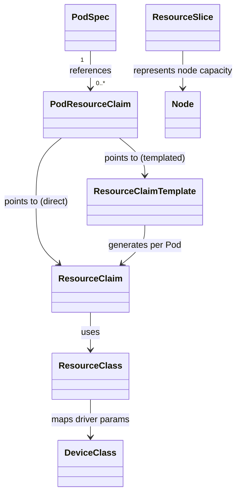
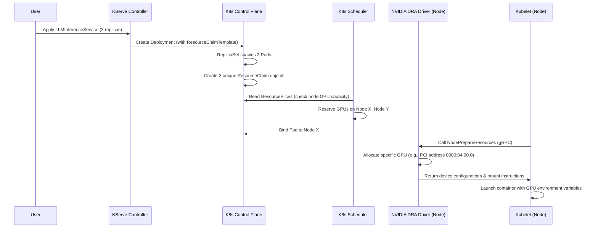

# Deep Dive: Kubernetes Dynamic Resource Allocation (DRA) & NVIDIA GPU Integration

This document provides a deep dive into **Kubernetes Dynamic Resource Allocation (DRA)** and how the **NVIDIA GPU Operator** integrates with it. It details the core API objects, how they interact, the lifecycle of a resource claim, and how to utilize custom parameters for advanced GPU features (e.g., MIG, MPS).

---

## 1. Why DRA? (vs. Device Plugins)

Historically, Kubernetes managed GPUs via the **Device Plugin API** (e.g., `nvidia.com/gpu`). While simple, it has critical architectural shortcomings for modern AI/ML workloads:

| Capability | Device Plugins | DRA (Dynamic Resource Allocation) |
| :--- | :--- | :--- |
| **API Integration** | Opaque to the control plane; handled via `resources.limits`. | First-class Kubernetes API objects under the `resource.k8s.io` group. |
| **Scheduling** | Simple resource counting (scheduler only knows "Node X has Y GPUs"). | Topology-aware; integrates with network, storage, and numa-node schedulers. |
| **Parameterization** | Static node-level configuration (fixed MIG, sharing). | Dynamic parameters requested per workload (e.g., request MPS or MIG profile via YAML). |
| **Initialization** | Device is allocated before Pod starts, locking the device. | Resources can be reserved, shared, and allocated dynamically per container. |

---

## 2. Core Kubernetes DRA API Objects

Kubernetes DRA introduces several resources under the `resource.k8s.io` API group. 



### A. ResourceClass (`resource.k8s.io/v1alpha3` / `v1beta1`)
A **cluster-scoped** resource that defines the driver handling the allocation and maps user requests to specific classes of hardware.
- **Key Fields**:
  - `driverName`: The gRPC identifier of the DRA driver (e.g., `gpu.nvidia.com`).
  - `parametersRef`: Reference to a configuration object containing global parameters for this class.

### B. ResourceClaim (`resource.k8s.io/v1alpha3` / `v1beta1`)
A **namespace-scoped** resource representing a workload's request for actual devices. It represents a single instance of resource allocation.
- **Key Fields**:
  - `resourceClassName`: The `ResourceClass` this claim belongs to.
  - `devices.requests`: Specific requests for count, attributes, or sharing.

### C. ResourceClaimTemplate (`resource.k8s.io/v1alpha3` / `v1beta1`)
A **namespace-scoped** template used by higher-level controllers (such as KServe Deployments or ReplicaSets) to dynamically generate unique `ResourceClaim` objects for individual pod replicas.
- **Key Fields**:
  - `spec.spec`: The exact specification for the generated `ResourceClaim`.

### D. ResourceSlice (`resource.k8s.io/v1alpha3` / `v1beta1`)
A **cluster-scoped** object created by the DRA driver running on each node. It publishes the raw hardware capacity (devices, VRAM, attributes) of a node to the Kubernetes API.
- **Why it matters**: In the **Structured Parameters** model (K8s 1.30+), the Kubernetes scheduler reads `ResourceSlices` directly to decide if a node can satisfy a Pod's claims *before* calling the driver. This eliminates the latency of querying node daemons during scheduling.

### E. DeviceClass (`resource.k8s.io/v1alpha3` / `v1beta1`)
Defines the parameters and capabilities available for a specific class of devices (e.g. `nvidia-h100` vs `nvidia-a100`).

---

## 3. NVIDIA DRA Operator Implementation

The **NVIDIA GPU Operator** includes a DRA driver that coordinates GPU allocations. When deploying NVIDIA GPUs with DRA, NVIDIA registers custom parameter resources to control GPU configurations dynamically.

### A. Core NVIDIA Driver Parameters
NVIDIA parameters are supplied to `ResourceClaim` objects via references. These configuration options include:

1. **Device Sharing**:
   - **None (Exclusive)**: Dedicated GPU allocation to a single container.
   - **MPS (Multi-Process Service)**: Share a physical GPU among multiple containers using hardware memory partitioning.
   - **MIG (Multi-Instance GPU)**: Hardware-level partitioning of a GPU (e.g., slicing an A100 into up to seven independent instances).

2. **Constraints and Filters**:
   - Request specific GPU models (e.g., `Tesla T4`, `A100-SXM4-80GB`).
   - Request minimal VRAM size (e.g., `memory: 20Gi`).
   - Request physical interconnect groupings (e.g., allocate 8 GPUs that are fully NVLinked).

---

## 4. Workload Allocation Lifecycle



---

## 5. Concrete Manifest Examples

Below is a complete structured parameters configuration example (K8s 1.30+) for setting up and consuming NVIDIA GPUs under DRA.

### 1. Global ResourceClass Setup
This defines the GPU class pointing to the NVIDIA DRA driver:

```yaml
apiVersion: resource.k8s.io/v1alpha3
kind: ResourceClass
metadata:
  name: nvidia-gpu
spec:
  driverName: gpu.nvidia.com
  structuredParameters: true # Enables K8s scheduler to read ResourceSlices
```

### 2. NVIDIA Specific Custom Parameter Definition
NVIDIA allows you to define custom claims parameter objects. For example, requesting a GPU with at least 24Gi of memory and enabling MPS sharing:

```yaml
apiVersion: gpu.nvidia.com/v1alpha1
kind: NvidiaGPUClaimParameters
metadata:
  name: mps-shared-gpu-params
  namespace: kserve-test
spec:
  sharing:
    strategy: MPS
    mpsConfig:
      memoryLimitPercent: 50 # Limit container to 50% of GPU VRAM
  constraints:
    selector: "gpu.nvidia.com/memory >= 24Gi"
```

### 3. ResourceClaimTemplate referencing NVIDIA Parameters
The claim template points to the `ResourceClass` and includes a reference to the NVIDIA parameter configuration:

```yaml
apiVersion: resource.k8s.io/v1alpha3
kind: ResourceClaimTemplate
metadata:
  name: nvidia-gpu-template
  namespace: kserve-test
spec:
  spec:
    resourceClassName: nvidia-gpu
    parametersRef:
      apiGroup: gpu.nvidia.com
      kind: NvidiaGPUClaimParameters
      name: mps-shared-gpu-params
    devices:
      requests:
      - name: gpu
        deviceClassName: nvidia-gpu
        count: 1
```

### 4. Consuming in Pod Spec (Inside KServe LLMInferenceService)
The Pod's template requests the GPU claim:

```yaml
apiVersion: v1
kind: Pod
metadata:
  name: qwen-inference-pod
  namespace: kserve-test
spec:
  resourceClaims:
  - name: gpu-alloc
    resourceClaimTemplateName: nvidia-gpu-template
  containers:
  - name: main
    image: ghcr.io/kserve/vllm-openai:latest
    resources:
      requests:
        cpu: "4"
        memory: 16Gi
      limits:
        cpu: "8"
        memory: 32Gi
      claims:
      - name: gpu-alloc # Binds the GPU claim specifically to the main container
```
